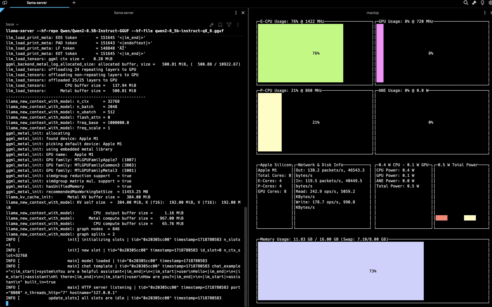
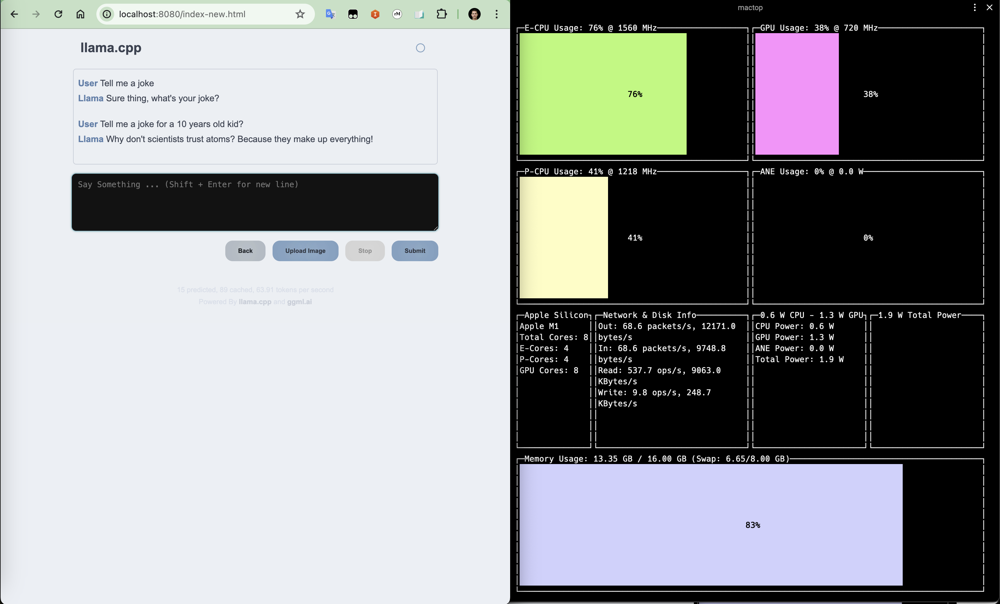

# Run your own LLM on your macOS using Llama.cpp


This was inspired by Valbhav S. From HuggingFace from a LinkedIn post [here](https://www.linkedin.com/posts/vaibhavs10_100-local-fully-private-llms-with-llamacpp-ugcPost-7202045828817903616-ryFv?utm_source=share&utm_medium=member_desktop).

Steps below show how to run a large language model (LLM) in your personal macos computer using [llama.cpp](https://github.com/ggerganov/llama.cpp).

```bash
#Step 1: Install llama.cpp
brew install llama.cpp

#Step 2: Install LLM from HuggingFace (MSF PHI3 or Qwen2 models)
llama-server --hf-repo microsoft/Phi-3-mini-4k-instruct-gguf --hf-file Phi-3-mini-4k-instruct-q4.gguf
#OR
llama-server --hf-repo Qwen/Qwen2-0.5B-Instruct-GGUF --hf-file qwen2-0_5b-instruct-q8_0.gguf

#Step 3: Interact with your LLM using port 8080 or through http://localhost:8080/
curl 8080/v1/chat/completions 

```




	

## **Background**:


**Llama.cpp**: a great way to run LLMs efficiently on CPUs and GPUs.


**GGML (GPT-Generated Model Language)**: Developed by Georgi Gerganov, GGML is a tensor library designed for machine learning, facilitating large models and high performance on various hardware, including Apple Silicon. (Ref. [here](https://medium.com/@phillipgimmi/what-is-gguf-and-ggml-e364834d241c))


**[GGUF](https://huggingface.co/docs/hub/en/gguf) (GPT-Generated Unified Format)**:  introduced as a successor to GGML (GPT-Generated Model Language), was released on the 21st of August, 2023. This format represents a significant step forward in the field of language model file formats, facilitating enhanced storage and processing of large language models like GPT.

