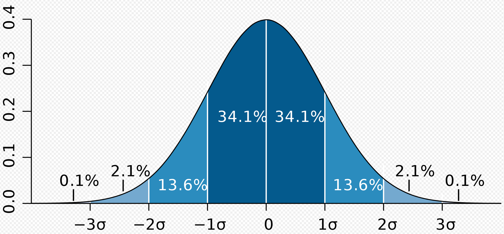
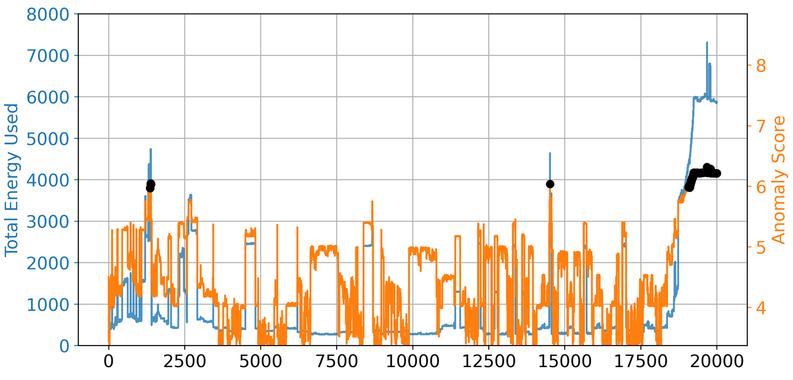

# Random Cut Forest

[Random Cut Forest (RCF)](https://www.amazon.science/publications/robust-random-cut-forest-based-anomaly-detection-on-streams) is an unsupervised  ML (machine learning) model normally used for anomaly detection problems. 

The idea behind RCF is to find anomalous data points which diverge from the data patterns during the observations. For example, in a time series scenario, an anomaly can appear as an unexpected spike in the data across time, or a disruption in data periodicity. Such anomalies are easy to distinguish when the data is visualized on a plot.

RCF as implemented by [Amazon SageMaker](https://docs.aws.amazon.com/sagemaker/latest/dg/randomcutforest.html)  establishes an **anomaly score** for each datapoint. A high anomaly score is an indication of anomaly in the data. However, a "low" or "high" score depends on the business application. However a common practice suggested is to consider the anomaly scores that goes beyond 3 standard deviations from the mean score. 

Standard deviation can be abbreviated **SD**, and is most commonly represented in mathematical texts and equations by the lower case [Greek letter](https://en.wikipedia.org/wiki/Greek_alphabet) **[σ](https://en.wikipedia.org/wiki/Sigma)** (sigma) [ref. [Wikipedia](https://en.wikipedia.org/wiki/Standard_deviation)]



Figure: A plot of [normal distribution](https://en.wikipedia.org/wiki/Normal_distribution) (or bell-shaped curve) where each band has a width of 1 standard deviation. Ref [Wikipedia](https://en.wikipedia.org/wiki/Standard_deviation).


An example of how to calculate it using python and pandas data frame is presented in the code below.

```python
sd_factor = 3 # standard deviation 
score_mean = total_data["score"].mean()
score_std = total_data["score"].std()
score_cutoff = score_mean + factor * score_std

anomalies = total_data[total_data["score"] > score_cutoff]
```


Examples of anomalies are shown in the figure below through black dots.

 


# Reference:

- [Robust random cut forest based anomaly detection on streams](https://www.amazon.science/publications/robust-random-cut-forest-based-anomaly-detection-on-streams)